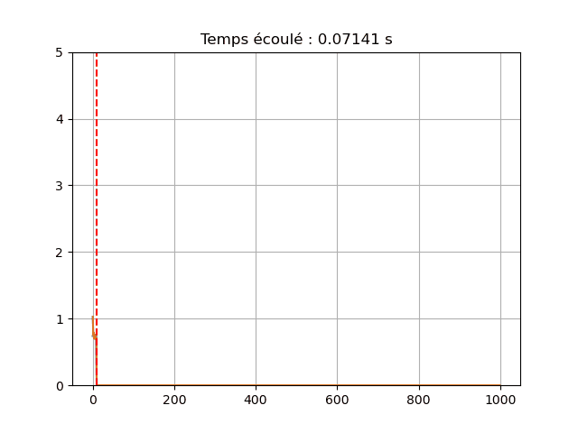

# Utiliser un Arduino et Python pour faire un oscilloscope (très basique) :

Vous trouverez ici un petit code Python (disponible sous forme de script et de notebook Jupyter) pour récupérer des données envoyées sur le port série par un Arduino et les tracer sur un graph déroulant (pour visualiser en temps réel un signal, comme sur un oscilloscope).

## Pré-requis

Cette page n'est pas un tutoriel détaillé et fait l'hypothèse que vous connaissez déjà les rudiments du fonctionnement d'un Arduino (voir par exemple [Aduino.cc](https://www.arduino.cc/en/Guide)) et que vous avez déjà installé un moyen de lire un code Python (utiliser par exemple [Anaconda](https://www.anaconda.com/products/individual)).

Le script requiert l'utilisation de la library [pyserial](https://github.com/pyserial/pyserial) qui s'installe facilement avec pip ou conda (si vous utilisez Anaconda, ouvrez l'Anaconda Prompt et tapez ``conda install pyserial`` dans l'invite de commande).

## Sketch Arduino

Pour la démonstration, vous trouverez un sketch pour Arduino Uno dans le dossier [sketch-arduino](./sketch-arduino) : ce sketch mesure la tension reçue sur les deux entrées analogiques A0 et A1 de l'Arduino et envoie les deux valeurs obtenues via le port série. Chaque point de mesure (qui contient donc deux valeurs de tension) est séparé par un temps de pause de 10 ms, ce qui fixe la fréquence d'acquisition du dispositif à environ 100 Hz.

Vous pouvez simplement charger ce sketch sur votre Arduino préféré, ou utiliser n'importe quel sketch qui demande à l'Arduino d'envoyer des données via le port série. Pour pouvoir utiliser le script Python sans modification, les données doivent être formatées de la façon suivante : 

- les valeurs mesurées simultanées sont séparées par une tabulation ``\tab`` 

- les points de mesure (qui peuvent contenir plusieurs valeurs) successifs sont séparés par un saut de ligne ``\n``

### Script Python

Vous trouverez dans le dossier [script-python](./script-python) un script Python qui récupère les données envoyées par l'Arduino sur le port série et les trace en temps réel sur un graph déroulant.

Pour éviter d'avoir à actualiser la figure trop régulièrement, les données sont récupérées "par bloc" et le graph n'est tracé qu'à chaque fois qu'un bloc de données complet a été mesuré. Le graph est "déroulant" ce qui signifie que les données les plus anciennes seront progressivement effacées par l'arrivée des points de mesures les plus récents.

Les paramètres du script sont :

- ``nb_donnees`` : le nombre de valeurs qui obtenues simultanément à chaque point de mesure (dans l'exemple  ``nb_donnees = 2`` puisqu'on mesure les tensions sur les entrées A0 et A1).

- ``taille_bloc`` : le nombre de points de mesure qui constituent un bloc de données (dans l'exemple ``taille_bloc=10`` donc un bloc de données est constitué de 10 points de mesure, ce qui signifie qu'il faudra ici environ 0,1 s pour qu'on bloc de données soit complet).

- ``nb_bloc_affich`` : le nombre de blocs successifs qui seront affichés sur le graph déroulant (dans l'exemple ``nb_bloc_affich= 100`` donc le graph déroulant contiendra au maximum 1000 points de mesure, ce qui représente environ 10 s d'acquisition continue).

- ``nb_bloc_max`` : le nombre maximal de blocs de données successifs qui seront mesurés avant que le script ne s'arrête (dans l'exemple `nb_bloc_max = 10000` donc sans interruption de la part de l'utilisateur, le script tournera pendant 1000 s, soit un peu plus d'un quart d'heure).

- ``y_min`` et ``y_max`` : les bornes (inférieures et supérieures) de l'axe y pour le graph déroulant (dans l'exemple ``y_min=0`` et ``y_max = 5`` puisqu'on ne mesure que des grandeurs entre 0 et 5 V). 

Le temps écoulé depuis le début de la mesure est indiqué en permanence en titre du graph déroulant (ce temps est mesuré dans le script Python et n'est pas nécessairement une mesure précise de l'instant auquel chaque point de mesure a été obtenu par l'Arduino).

Il est toujours possible d'interrompre manuellement l'acquisition des données avant la fin (par exemple si on a mis un nombre trop grand pour la variable ``nb_bloc_max``) à l'aide de la combinaison de touche "KeyboardInterrupt" (``ctrl + c`` dans Spyder).

### Notebook Jupyter

Une version alternative du script est disponible sous forme de [notebook Jupyter](./notebook-python/oscilloscope_arduino_python.ipynb) et fonctionne sur le même principe que le script décrit ci-dessus.

Il est toujours possible d'interrompre manuellement l'acquisition des données avant la fin (par exemple si on a mis un nombre trop grand pour la variable `nb_bloc_max`) à l'aide de la touche "stop" du menu d'éxecution de Jupyter.

Une vidéo de démonstration est disponible [ici](./images/demo_notebook.mp4).

## Dépendances

- [numpy](https://numpy.org/) (tested with ver 1.19.1)
- [matplotlib](https://matplotlib.org/index.html) (tested with ver 3.3.1)
- [pyserial](https://shapely.readthedocs.io/en/latest/manual.html) (tested with ver 3.5)

## License

[MIT](https://choosealicense.com/licenses/mit/) 

(Vous avez le droit illimité d'utiliser, copier, modifier, fusionner, publier, distribuer, vendre et « sous-licencier » l'intégralité de ces scripts. Votre seule obligation est d'incorporer la notice de licence et de copyright dans toutes les copies.)
