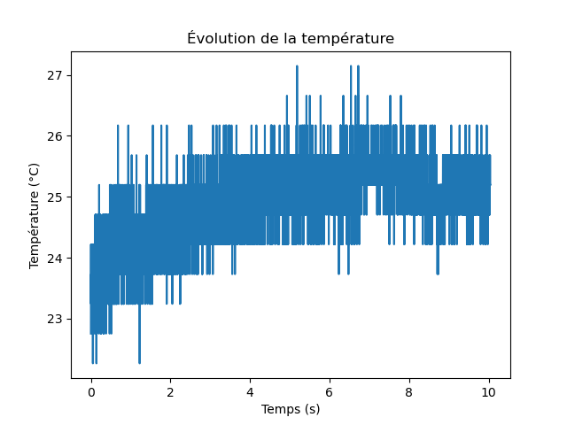
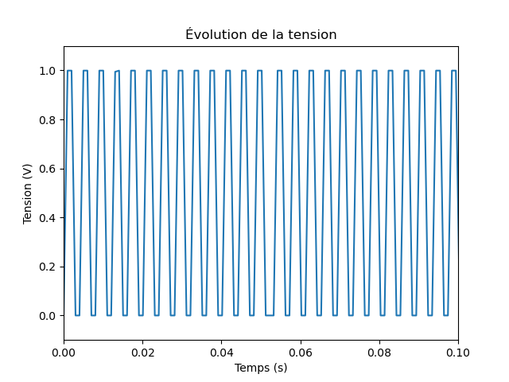
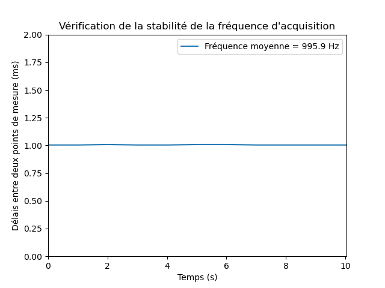

# Utiliser un Arduino et Python pour faire de l'acquisition de données :

Vous trouverez ici un petit code Python (disponible sous forme de script et de notebook Jupyter) pour récupérer des données envoyées sur le port série par un Arduino, contenant une valeur et l'instant à laquelle cette valeur a été prise.

### Sketch Arduino

Pour la démonstration, vous trouverez un sketch pour Arduino Uno dans le dossier [sketch_mesure_tension_1kHz](./sketch-arduino/sketch_mesure_tension_1kHz) : ce sketch mesure la tension reçue sur l'entrée analogiques A0 toutes les 1 ms (fréquence d'acquisition de 1 kHz), et renvoie sur le port série la valeur de tension en bit (valeur comprise entre 0 et 1023) ainsi que le "time-stamp" de cette valeur, c'est-à-dire l'instant à laquelle la mesure a été prise.

Vous pouvez simplement charger ce sketch sur votre Arduino Uno préféré, ou utiliser n'importe quel sketch qui demande à un Arduino d'envoyer des données via le port série. Pour pouvoir utiliser le script Python sans modification, les données doivent être formatées de la façon suivante : 

- les valeurs mesurées simultanées sont séparées par une tabulation ``\t`` 

- les points de mesure (qui peuvent contenir plusieurs valeurs) successifs sont séparés par un saut de ligne ``\n``

**Note** :

Ici le time-stamp correspond au nombre de microsecondes qui se sont écoulées depuis que l'Arduino a démarré, renvoyé par fonction [micros()](https://www.arduino.cc/reference/en/language/functions/time/micros/) de l'Arduino. Étant donné que cette valeur est stockée sur 32 bits ([unsigned long](https://www.arduino.cc/reference/fr/language/variables/data-types/unsignedlong/)), la valeur repartira à 0 après environ 70 minutes de fonctionnement continu.

### Script Python

Vous trouverez dans le script Python [mesure_arduino_python](./script-python/mesure_arduino_python.py) une fonction ``mesure-arduino`` qui récupère les données envoyées par l'Arduino sur le port série et les renvoie sous forme d'un tableau de données.

Les paramètres d'entrée sont :

- ``nb_donnees`` : le nombre de valeurs qui obtenues simultanément à chaque point de mesure.
  (dans l'exemple  ``nb_donnees = 2`` puisqu'on récupère des temps et des valeurs de tension).

- ``nb_mesures`` : le nombre de points de mesures successifs qu'on veut enregistrer.

La fonction renvoie :

- ``data`` une "array" Numpy de dimension (``nb_donnees`` x ``nb_mesures``).

Les données ainsi récupérées peuvent ensuite être traitées et tracées en utilisant Python.

Par exemple si la tension correspond à une mesure de température :

Ou si la tension est une fonction créneau générée par la fonction [tone()](https://www.arduino.cc/reference/en/language/functions/advanced-io/tone/) d'un autre Arduino :

Il est également possible de contrôler si la fréquence d'acquisition de l'Arduino est bien celle désirée (dans l'exemple on attend une fréquence de 1 kHz). Pour cela, on tracera pour chaque point de mesure, le délais temporel entre ce point et le point de mesure suivant :

**Note** :

Il est toujours possible d'interrompre manuellement l'acquisition des données avant la fin à l'aide de la combinaison de touche "KeyboardInterrupt" (``ctrl + c`` dans Spyder), dans ce cas la fonction renvoie le tableau de données ``data`` qui contiendra les données acquises avant l'interruption.

### Notebook Jupyter

Une version alternative du script est disponible sous forme de [notebook Jupyter](./notebook-python/Mesure_arduino_python.ipynb) et fonctionne sur le même principe que le script décrit ci-dessus.

**Note** :

Il est toujours possible d'interrompre manuellement l'acquisition des données avant la fin à l'aide de la touche "stop" du menu d'éxecution de Jupyter, dans ce cas la fonction renvoie le tableau de données `data` qui contiendra les données acquises avant l'interruption.
